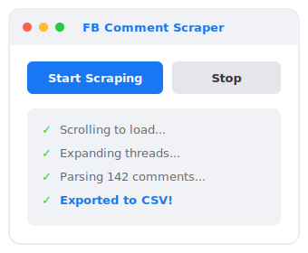

<div align="center">


<br>

**Chrome Extension (Manifest V3) to scrape Facebook post comments and export to CSV**

[](https://developer.chrome.com/docs/extensions/)
[](https://developer.chrome.com/docs/extensions/mv3/)
[](LICENSE)
[](https://developer.mozilla.org/en-US/docs/Web/JavaScript)

---

</div>

## Demo

<p align="center">
  
</p>

## Features

| Feature | Description |
|---------|-------------|
| **Auto-Scroll** | Scrolls the entire page to load all comments |
| **Thread Expansion** | Clicks "View more comments", "See more", and reply threads |
| **Smart Parsing** | Extracts author name, comment text, and timestamp |
| **CSV Export** | One-click download as `fb_comments.csv` |
| **Dual Layout** | Works on both desktop and mobile Facebook views |

## Quick Start

### 1. Install

```bash
git clone https://github.com/dan-tech-academy/fb-comments-export-extensions.git
```

Then load in Chrome:

```
chrome://extensions → Enable Developer mode → Load unpacked → Select folder
```

### 2. Scrape

```
Open Facebook post → Resize window to narrow width* → Click extension → Start Scraping
```

> **Pro tip:** Resize the browser window to a narrow width so Facebook loads its mobile layout. This makes scraping **more precise and faster**.

### 3. Export

The extension auto-downloads `fb_comments.csv` when finished:

```csv
Author,Comment,Date
"John Doe","Great post!","2d"
"Jane Smith","Thanks for sharing","1w"
```

## How It Works

```
┌──────────┐     ┌──────────────┐     ┌──────────────┐     ┌────────────┐
│  Popup   │────▶│  Auto-Scroll │────▶│   Expand     │────▶│   Parse    │
│  Start   │     │  Load All    │     │   Threads    │     │  Comments  │
└──────────┘     └──────────────┘     └──────────────┘     └─────┬──────┘
                                                                  │
                                                                  ▼
                                                           ┌────────────┐
                                                           │  Download  │
                                                           │   CSV      │
                                                           └────────────┘
```

## Limitations

- Facebook frequently changes its DOM structure — selectors may need updating if scraping stops working.
- Very large exports may hit browser size limits for `data:` URI downloads.

---

<div align="center">

### Sponsored by

[](https://www.dantech.academy)

**Part of the tutorial series by [DanTech Academy](https://www.dantech.academy)**

This project is sponsored by the [**Kotlin Accelerator Course**](https://www.dantech.academy/kotlin-accelerator) — a hands-on course to master Kotlin from fundamentals to advanced topics.

[](https://www.dantech.academy/kotlin-accelerator)

---

**MIT License** · Made with JavaScript · No dependencies

</div>
